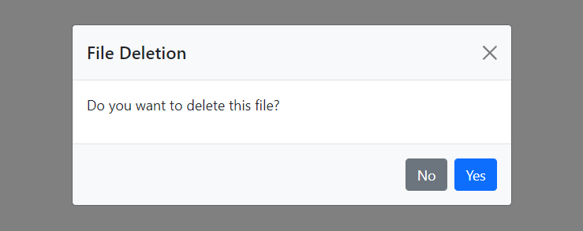

# Dynamic BS5 Modal Box
Create Bootstrap 5 Modal Box using JavaScript with custom title, description, button labels and custom YES button callback

## Install
```html
<!-- Bootstrap 5 CSS -->
<link 
href="https://cdn.jsdelivr.net/npm/bootstrap@5.0.0-beta1/dist/css/bootstrap.min.css" 
rel="stylesheet"
integrity="sha384-giJF6kkoqNQ00vy+HMDP7azOuL0xtbfIcaT9wjKHr8RbDVddVHyTfAAsrekwKmP1" 
crossorigin="anonymous">

<!-- Bootstrap 5 JS -->
<script 
src="https://cdn.jsdelivr.net/npm/bootstrap@5.0.0-beta1/dist/js/bootstrap.bundle.min.js"
integrity="sha384-ygbV9kiqUc6oa4msXn9868pTtWMgiQaeYH7/t7LECLbyPA2x65Kgf80OJFdroafW"
crossorigin="anonymous"></script>

<!-- Dynamic Modal JS -->
<script src="modal-with-custom-action.js"></script>
```
## Usage
```js
// showModal(title, description, yesBtnLabel = 'Yes', noBtnLabel = 'Cancel', callbackAfterClickingYesBtn);
document.getElementById('btn1').onclick = () => showModal('File Deletion', 'Do you want to delete this file?', "Yes", "No", () => {
    console.log('File deleted successfully');
});
```

